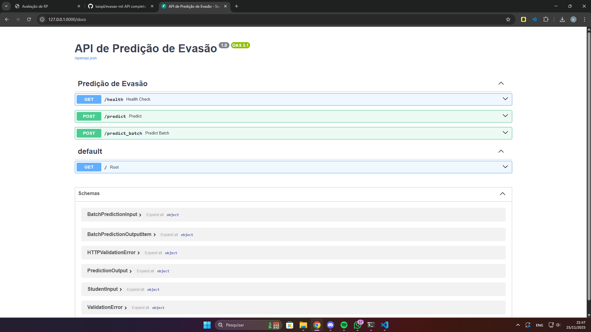

# API de Predição de Evasão Estudantil

Modelo de Regressão Logística + FastAPI (Arquitetura MVC)

Este projeto implementa um sistema completo de **predição de evasão
estudantil**, incluindo:

-   **Treinamento de um modelo de Regressão Logística** (scikit-learn)\
-   **API REST em FastAPI**, organizada no padrão **MVC**\
-   **Endpoints para predição individual e em lote**\
-   **Documentação automática /docs**\
-   **Separação clara entre Model, View e Controller**

------------------------------------------------------------------------

## Estrutura do Projeto

    evasao-ml/
    │
    ├── train_model.py        # Script de treinamento do modelo
    ├── requirements.txt
    ├── data/
    │   └── alunos.csv        # Dataset de treinamento
    ├── model/
    │   └── logistic_model.pkl
    │
    └── app/
        ├── main.py
        ├── core/
        │   └── config.py
        ├── models/           # (opcional)
        ├── schemas/
        │   ├── student_schema.py
        │   └── prediction_schema.py
        ├── controllers/
        │   └── prediction_controller.py
        ├── services/
        │   └── ml_service.py
        └── views/
            └── prediction_view.py

------------------------------------------------------------------------

# Como rodar o projeto

## Criar ambiente virtual

``` bash
python -m venv venv
```

Ativar:

-   **PowerShell**

    ``` bash
    venv\Scripts\Activate.ps1
    ```

-   **CMD**

    ``` bash
    venv\Scripts\activate
    ```

------------------------------------------------------------------------

## Instalar dependências

``` bash
pip install --upgrade pip
pip install -r requirements.txt
```

Se ainda não tiver `requirements.txt`:

``` bash
pip freeze > requirements.txt
```

------------------------------------------------------------------------

## Inserir o dataset

Coloque o arquivo:

    data/alunos.csv

------------------------------------------------------------------------

## Treinar o modelo

``` bash
python train_model.py
```

------------------------------------------------------------------------

## Subir a API FastAPI

``` bash
uvicorn app.main:app --reload
```

A API estará disponível em:

http://127.0.0.1:8000\
Documentação Swagger: http://127.0.0.1:8000/docs

------------------------------------------------------------------------

# Endpoints da API

## GET /health

Verifica se a API está funcionando.

------------------------------------------------------------------------

## POST /predict

Predição para um único aluno.

------------------------------------------------------------------------

## POST /predict_batch

Predição para múltiplos alunos.

------------------------------------------------------------------------

# Tratamento de erros

-   Campos faltando → **422**
-   Modelo ausente → **500**
-   Tipos inválidos → **422**

------------------------------------------------------------------------

# Arquitetura MVC

-   **Model:** schemas + ML\
-   **View:** rotas FastAPI\
-   **Controller:** lógica de negócio

------------------------------------------------------------------------

# Demonstração



# Licença

Livre para uso acadêmico.
